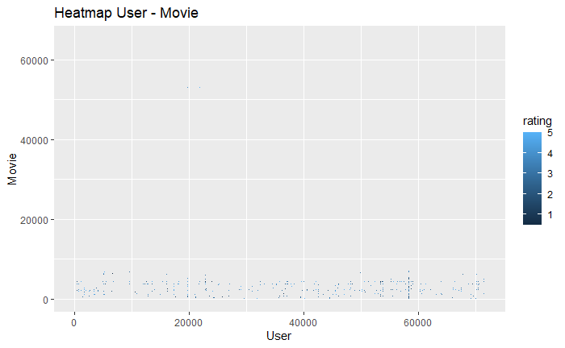

```{r setup, include=FALSE}
knitr::opts_chunk$set(cash = TRUE)

# Register an inline hook - this part is to manage decimal display
knitr::knit_hooks$set(inline = function(x) {
  paste(custom_print(x), collapse = ", ")
})

# Define a function 
op <- function(d = 2) {
  function(x) sprintf(paste0("%1.", d, "f"), x)
}

# Use a closure
custom_print <- op()
```

\newpage

# 1 Introduction

```{r print_integer, include=FALSE}
custom_print <- op(d = 0)
```

For the project Movielens, I've created a movie recommendation system based on the MovieLens dataset. The dataset size is 10M.
Data located at http://files.grouplens.org/datasets/movielens/ml-10m.zip.

I've used the course "PH125.8x: Data Science: Machine Learning by Professor R.Irizarry (Introduction to Data Science book on  https://rafalab.github.io/dsbook/)" as the main inspiration for my development work.

The project aims to predict movie ratings based on available features and demonstrate knowledge and skills learned during the HarvardX Professional Certificate in Data Science program. 

First, let's describe the dataset. 
Each line represents the rating of one user for one movie. Dataset movielens has `r predictors` predictors and `r observations` observations. 


Here is a preview of the dataset:

```{r original_dataset_preview, message=FALSE, warning=FALSE, echo=FALSE}
options(width=90)
head(movielens)
```


The predictors are: 

  + __userId__ is a unique user identification;
  + __movieId__ is a  unique movie identification;
  + __rating__ is a value from 0.5 to 5 provided by user *U* for movie *i* ;
  + __timestamp__ is a date and time of the rating;
  + __title__ is a movie title;
  + __genres__ is a movie genre.


One of the first observations regarding data is the format of the __timestamp__ field. I've applied the function *as_datatime()* to transform it into date format.

The column __title__ has two entities: release year and movie name. I've separated the column into two parts - the movie title and release year. 

The column __genres__ combines several basic types like Comedy, Romance, Action, or Drama, and others. I've used it as it is, without splitting it into basic types.

First, I performed a descriptive data analysis to understood data,  research missing values, clean, transform, and identify trends.

Second, I split the original dataset into training and validation sets.

After, I built the model to predict the movie rating based on available predictors. The highest rating suggested that the user will like the movie. 
I trained my model on the training data set and verified accuracy on the validation dataset. To compare different models, I used root mean squared error (RMSE) as a loss function. The objective was to obtain an RMSE of less than 0.86490.

As I inserted variable values directly in the report text, I did not use standard knit menu to create pdf output, but instead I used command *rmarkdown::render("file_name")* to compile in pdf output.

Lastly, I provided some conclusions about my findings and suggestions regarding future development. 
\newpage

# 2 Methods/ analysis
## 2.1 Dataset detailed description

First I've checked missing, null values and data with non expected format for each features. No anomalies were found. 

Another way to verify missing value is used *summary()* function:
```{r original_dataset_summary, message=FALSE, warning=FALSE, echo=FALSE}
 options(width=90)
 summary(movielens)
```

I've did followed data transformation: 

+ field __timestamp__ was convert to data format;
+ field __title__ was split into two columns: movie title ( __Title__ ) and year of movie release ( __YearM__);
+ add new field __Age__, which is age of movie at the moment of rating;
+ add new field __Word_title__, count number of worlds in move title.

The transformed dataset looks like, preview of first 6 lines:

```{r transformed_dataset_preview, message=FALSE, warning=FALSE, echo=FALSE}
 options(width=90)
 head(movielens_transformed)
```

and results of *summary()* function:

```{r transformed_dataset_summary, message=FALSE, warning=FALSE, echo=FALSE}
 options(width=90)
 summary(movielens_transformed)
```

Same verification (missed, null and different format values) was applied to transformed columns. Again, no anomalies were found.
For the details please check code source.

Let's review more in details each of predictors.

From *summary()* function we can see that __rating__ has values from 0.5 and 5 and 4 is most frequent rating (median value).

Let's build histogram to see the rating distribution.


```{r rating, message=FALSE, warning=FALSE, echo=FALSE}
gg_rating_histo
```

In majority of cases user tend to provide entire number as i.e. 3 then 3.5 . Also we can see that tendency is provide rather positive feedback, with median values 4. 

__Userid__ - represent identification of user who provided rating. From *summary()* function results we can see that userid is a number between 1 and 71567. Others information provided by *summary()* for __UserId__ is not very useful, as data is identification code.

In Movielens dataset we have `r nbr_users$count` different users. 

Not all users have same rating activity, as number of rating per users is vary between min `r min_nbr_rates$min` and maximum `r max_nbr_rates$max`.

Here is user rating activity:

```{r user_nbr_rating, message=FALSE, warning=FALSE, echo=FALSE }
gg_nbr_rates
```


```{r back_to_default, include=FALSE}
custom_print <- op(d = 2)
```


As we can observe majority of users have small number of ratings, very active users rather exception. We can calculate that `r user_100q$total/nbr_users*100` provided less than 100 ratings and `r user_400q$total/nbr_users*100` provided less than 400 ratings. 

\newpage

Another question that we can answer is for how long user provide their feedback and what are average feedback (rate) number per specific period of time (i.e. per day). For certain users time period when they provided movie rating is `r user_obs_long$min` days and for others it is `r user_obs_long$max / 365` years.

I've build table to see how many users provided specific number of feedback per day, Here is sample:

```{r tab_user_feedback, message=FALSE, warning=FALSE, echo=FALSE }
tab_user_feedback
```

We can classify users based on number of feedback per day as normal, who i.e. provided up to 2 feedback per day in average, or very active movie watcher depending on daily rate. However it is difficult to imagine that person watch more than 12 movies per day. I can just conclude that Movielens is combination of user rating provided after watching movies and i.e. results of different surveys or even results of automated process .

Here is relationship between how long user provide feedback ( difference between first rate date and date for latest rate) and number of rates per day:

```{r gg_user_observation, message=FALSE, warning=FALSE, echo=FALSE }
gg_user_observation
```


From this plot we can observe that users with very high number of feedback per day tend to have very short period when they provided feedback. Users with smallest rate per day number tend to provide their feedback on longer periods.

Here is the distribution of average users's ratings:

```{r gg_user_rating, message=FALSE, warning=FALSE, echo=FALSE }
gg_user_rating
```

User's rating has slightly left skeed distribution. Maximum of user provide rating between 3 and 4, and we have more users with rating above 4 than less 3.

```{r tab_user_rating, message=FALSE, warning=FALSE, echo=FALSE }
user_tab
```

Another observation here or large part of movies is very appreciated, or that user tends to provide rating when then like movie. However we can see that we have important differentiation in each user feedback, some user are more generous in their rate and some are very critical.

__MovieId__ - movie identification varies between 1 and 65133. Similar to user, we can find that dataset has `r nbr_movies` different movies. Each movie has number of rating between min `r min_nbr_m_rates$min` and maximum `r max_nbr_m_rates$max`.
Here is distribution about how many rating receive movie

```{r gg_nbr_movie_rating, message=FALSE, warning=FALSE, echo=FALSE }
gg_nbr_movie_rating
```

We can observe that largest part of movies receive small number of rates.

Here is distribution of movie average ratings

```{r gg_movie_rating, message=FALSE, warning=FALSE, echo=FALSE }
gg_movie_rating
```

We also can clearly see that even if majority of movies have average rating close to total average rating, they have individual impact in the same way as user. Some movies are more appreciated then others.

\newpage

Heatmap for user- movie rating provide interesting inside on data that available for us:




Heatmap provide interesting view of user-movie rating. We can see that majority of Movie - User missing rating and we do not know if this is due to fact that user does not watch movie or just does not provide feedback.
I has technical problems to include heatmap results in R chunk, i.e. very long compilation time and pdf did not displayed result properly (long time prior plot is visible). As workaround I've generate heatmap in my R script, save results in file and add file as image in the report.


__YearM__ - year of movie release. In movielens dataset we have movies between 1915 (the most old) and 2008 (the most recent movies), in total 93 years of movie production. We can also observe that 1994 is year with biggest movie releases and 75% of all movies were produced between 1915 & 1998.
Here is movie release distribution:
```{r gg_year_p, message=FALSE, warning=FALSE, echo=FALSE }
gg_year_p
```
We can also observe that until 2000 number of movies per year constantly increased and after 2010 this number is declined.

__Genres__ - described movie category, each movie can have several genres combination. In total we have `r nbr_genres`. 
Each genre has different number of movies, here is list of 10 genres with highest number of movies:

```{r genres_m_top10, message=FALSE, warning=FALSE, echo=FALSE }
genres_m_top10
```
 
 and 10 genres with minimum number of movies:

```{r genres_m_bot10, message=FALSE, warning=FALSE, echo=FALSE}
genres_m_bot10
```


Here we can see how frequently user provides rate per movie genre:

```{r gg_genres, message=FALSE, warning=FALSE, echo=FALSE}
gg_genres
```

This rating numbers various between `r min_nbr_genres$min` (min value) and `r max_nbr_genres$max` (max value).
Top 10 genres with highest number of rating:

```{r genres_top, message=FALSE, warning=FALSE, echo=FALSE}
 genres_top
```

10 Genres with less number of rating:

```{r genres_bot, message=FALSE, warning=FALSE, echo=FALSE}
genres_bot
```


As we can see Drama and Comedy obtain highest number of ratings, which is normal as they also have biggest number of movies in both categories.

Similar analysis on average rating per genres:

```{r gg_genres_r, message=FALSE, warning=FALSE, echo=FALSE}
gg_genres_r
```

As we can see rating will depends on movie genres.
With 10 top genres that receive higher rating

```{r genres_top_r, message=FALSE, warning=FALSE, echo=FALSE}
genres_top_r
```

And 10 less rated
```{r genres_bot_r, message=FALSE, warning=FALSE, echo=FALSE}
genres_bot_r
```

__Age__ - as per *summary()* function we can see that age of movie at the moment of rating various between -2 and 93 years. Ratings with negative movie age or mistake, or rating was provided before movie release.

In total we have `r yearly_reviewed$count` movies that received feedback before release.

We can see that number of rating is grow up during first year, with maximum at one year after movie release and decrease after one year:

```{r gg_age, message=FALSE, warning=FALSE, echo=FALSE}
gg_age
```

The impact of __AgeM__ on ratings:

```{r gg_age_rate, message=FALSE, warning=FALSE, echo=FALSE}
gg_age_rate
```

__Date__ - date of rating, from *summary()* function result we can see that first rating was provided in 1995 and latest one in 2009, movielens dataset has 15 years of user observations.
We can observe how number of user ratings various from year to year:

```{r gg_date_rating, message=FALSE, warning=FALSE, echo=FALSE}
gg_date_rating
```

Variation during one year does not observe particular pattern, as i.e. if we compare 2000 and 2005 we can see that pick of rating is November for 2000 and March in 2005:
```{r gg_date_rating_y2000, message=FALSE, warning=FALSE, echo=FALSE}
gg_date_rating_y2000
```


```{r gg_date_rating_y2005, message=FALSE, warning=FALSE, echo=FALSE}
gg_date_rating_y2005
```


__Title__ - as this is character value and individual movie title, *summary()* function does not provide useful info. I've used this column to try to identify sentiment links to movie title, but for majority of movies no sentiment (N/A) was identified.

__Word_title__ - this column was build as number of worlds in movie title. From *summary()* we can see that we have between 1 (min value) and 28 (maximum) words in movie title. In majority movie tend to have short title ( with mean of 2 and third quartile of 4 words in title).

Impact on rating of __Word_title__ :

```{r gg_word, message=FALSE, warning=FALSE, echo=FALSE}
gg_word_rate
```

\newpage

## 2.2 Model building

```{r print_high_presicion, include=FALSE}
custom_print <- op(d = 5)
```

Usage of classic methods as i.e., linear regression, the random forest was not possible, as large datasets generate memory issues. The linear regression for one predictor at my laptop took more than 15 min to execute.  It was not possible to increase the number of predictors in the model, even with additional memory allocations. I've observed a similar issue with random forest. 
So, as in Harvard Machine learning courses, I've tried some naive approaches, i.e., using average movie rating as a prediction.  At each step, the model was trained at the train set and evaluated at the validation set. A program keep the results of each model evaluation for future comparison.

My first very simple model presented as $X_{u,i} = \mu + \epsilon_{u,i}$ 
where 

 + $X_{u,i}$ is rating provided by user u for movie i, 
 + $\mu$ is total movies average ratings,
 + $\epsilon_{u,i}$ - error for rating for user u, for movie i.

The RMSE at this first step is `r naive_rmse`.

In the next two steps, I've reproduced Harvard's course models by including particular movie $b_{i}$ and users $b_{u}$ effects. In data analysis step I've saw that user and movie, both has impact on rating results. Same as in the course model, each additional feature brings improvements in model accuracy.

Here is individual movies impact:

```{r movie_impact, message=FALSE, warning=FALSE, echo=FALSE}
gg_movie_impact 
```


And users impact:

```{r users_impact, message=FALSE, warning=FALSE, echo=FALSE}
gg_user_impact
```


With movie impact RMSE is `r model_1_rmse` and with additional user impact RMSE is `r model_2_rmse`.

To drive more in deep, I've included additional effects such as genres and movie age effects. Those effects also improved the model.

Here is the genres impact:

```{r genres_impact, message=FALSE, warning=FALSE, echo=FALSE}
gg_genres_impact
```


RMSE after this enhancement is `r model_3_rmse`.

Impact of __AgeM__:

```{r age_impact, message=FALSE, warning=FALSE, echo=FALSE}
gg_age_impact
```

RMSE after age step is `r model_4_rmse`.

I've tried to perform sentiment analysis on the movie title. Still, I did not identify sentiments for many movies, and the results were not significant to include in the model.
Finally, I also explore if Title (i.e., if a short or long title influences rating).

Here is impact of __Word_title__ (Nbr of word in title) impact:

```{r title_impact, message=FALSE, warning=FALSE, echo=FALSE}
gg_count_impact
```


RMSE after final step is `r model_5_rmse`.

My final model is $X_{u,i} = \mu + b_{i}+ b_{u} +b_{i,g} +b_{i,a} +b_{i,c} + \epsilon_{u,i}$
where 

 + $X_{u,i}$ is rating provided by user u for movie i,
 + $\mu$ is total movies average ratings,
 + $b_{i}$ - movie i effect,
 + $b_{u}$ - user u effect,
 + $b_{i,g}$ - movie i, genres effect,
 + $b_{i,a}$ - movie i, age effect,
 + $b_{i,c}$ - movie i, title length effect,
 + $\epsilon_{u,i}$ - error for rating for user u, for movie i.
 
# 2.3 Results
RMSE results for each model:
```{r rmse_results, message=FALSE, warning=FALSE, echo=FALSE}
rmse_res
```
As we can see final model obtain desired precision. Last model "Movie User Genres Age Title Model" is final model.

\newpage

## 4 Conclusion
In this last section, I would like to review the limitations of the current study and mention possible future opportunities.

One of limitation of this method is that we need to have some ratings already provided by user, it will works less well for new users in dataset.

I've used only explicit feedback, which in our case was the user's rating. Data explicitly provided by user limits research. As most users do not rank  all movies that they watch, it may be more interesting to evaluate implicit feedback (i.e., instead of rating, collect what movies users watch completely or how long users interact with the film.)

Another point is that some other information will be useful as, i.e., actors or director as if you like the actor you may also be interested in seeing other movies with this actor.

## References

+ PH125.8x: Data Science: Machine Learning of Professor R.Irizarry (Introduction to Data Science book on  https://rafalab.github.io/dsbook/)
+ http://blog.echen.me/2011/10/24/winning-the-netflix-prize-a-summary/
